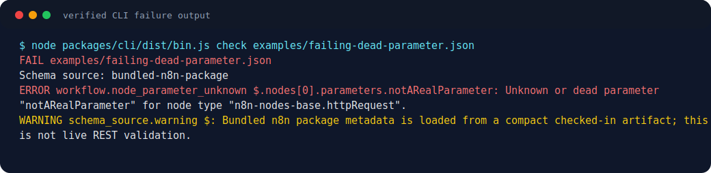
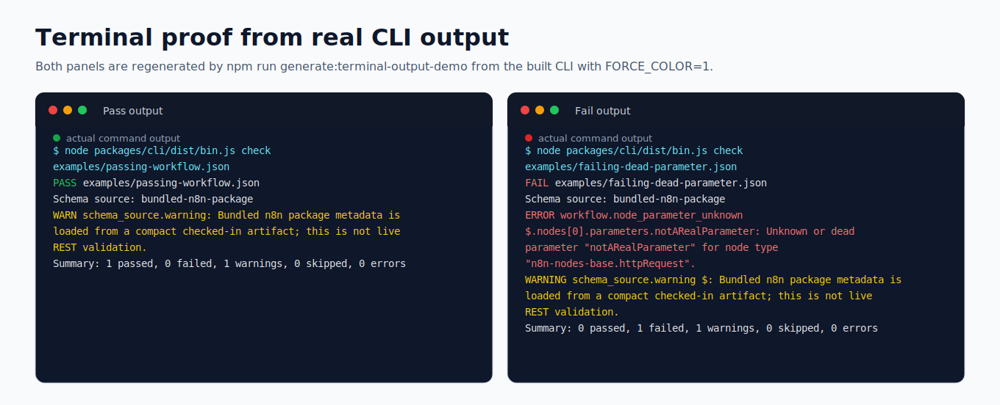
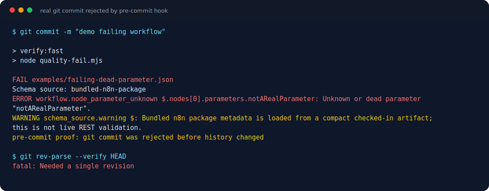
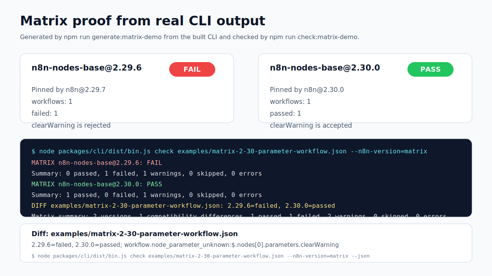
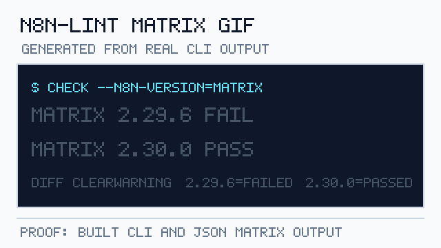
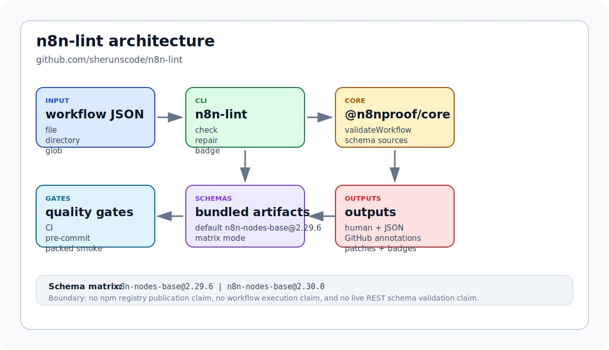
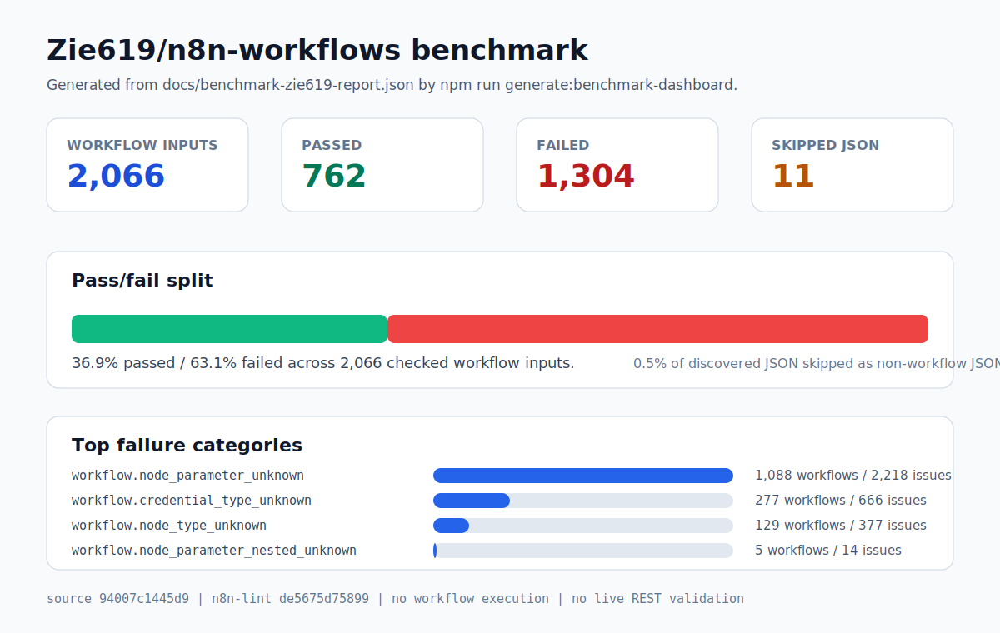
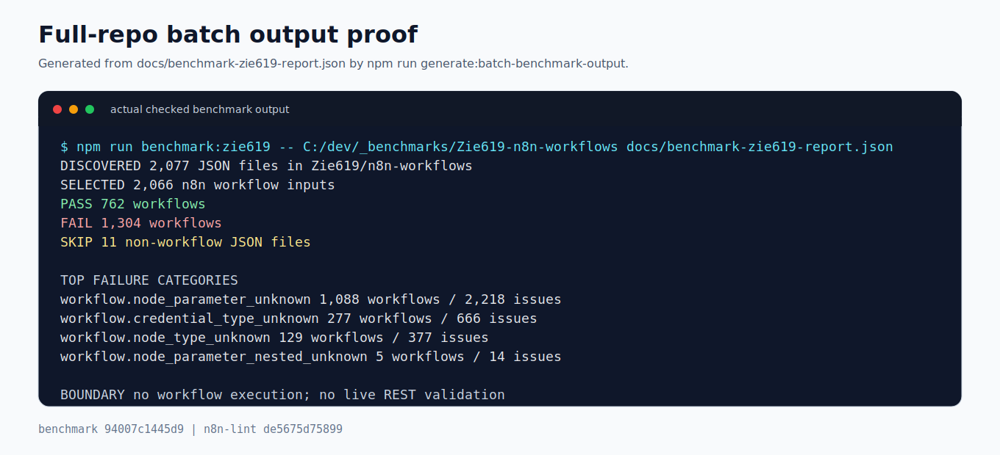
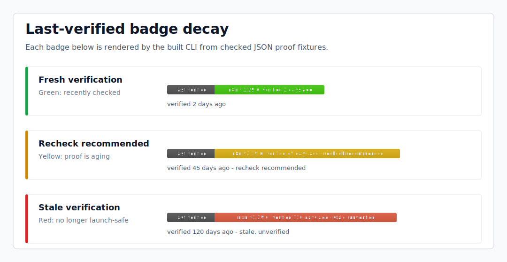

# n8n-lint

[](https://github.com/sherunscode/n8n-lint/actions/workflows/ci.yml)
[](LICENSE)

Validate n8n workflow JSON before it reaches production.

`n8n-lint` is the first n8nproof tool from She Runs Code. It exists because
production n8n workflows can fail from stale node names, renamed credential
types, dead parameters, stale trigger graph shapes, and schema drift that static
template collections do not catch.

The project came out of ERLV Inc operating n8n in production at
`n8n.erlvinc.com`, where minor-version workflow drift is an operator problem,
not an abstract template-quality problem.

This repository is still a local MVP. It is not published to npm yet and does
not claim live REST schema validation yet. Today the verified paths are a source
checkout, a packed local tarball install, and a reproducible local benchmark
report against `Zie619/n8n-workflows`; registry-backed `npx n8n-lint` usage
will only be documented after npm publication.



The image above is generated by `npm run generate:readme-demo` from the built
CLI and checked by `npm run check:readme-demo`.

`docs/assets/animated-failure-demo.svg` is an animated version of the same
fixture proof, generated by `npm run generate:animated-demo` from actual CLI
output and checked by `npm run check:animated-demo`.



The terminal proof above is generated by `npm run generate:terminal-output-demo`
from actual colored pass and fail CLI output, then checked by
`npm run check:terminal-output-demo`.



The pre-commit proof above is generated by
`npm run generate:precommit-rejection-demo` from an actual temporary `git commit`
that is rejected by the repo's real `.githooks/pre-commit` hook, then checked by
`npm run check:precommit-rejection-demo`.



The matrix proof above is generated by `npm run generate:matrix-demo` from real
`check --n8n-version=matrix` CLI and JSON output for a fixture that fails under
`n8n-nodes-base@2.29.6` and passes under `n8n-nodes-base@2.30.0`, then checked
by `npm run check:matrix-demo`.



The matrix GIF above is generated by `npm run generate:matrix-gif` from the
same real matrix CLI and JSON output, then checked by
`npm run check:matrix-gif`.

## Proof and Boundaries

- CI: the badge links to the latest public `main` quality run.
- Release proof workflow: `.github/workflows/release.yml` runs quality, release
  contract checks, package dry-runs, and local tarball artifact upload without
  npm publish, tag push, or GitHub Release creation.
- The release proof artifact upload includes `release-artifact-manifest.json`
  next to the local tarballs.
- Current install paths: source checkout and packed local tarball only until npm
  publication.
- Current validation: workflow structure, bundled n8n node type names, bundled
  credential type names, top-level node parameter names, structured nested
  collection/fixedCollection/filter parameter keys, and trigger graph/type-version
  shape.
- Current schema selectors: pinned bundled artifacts for `n8n-nodes-base@2.29.6`
  and `n8n-nodes-base@2.30.0`, plus matrix mode.
- Benchmark: `docs/benchmark-zie619-report.md` records the reproducible
  `Zie619/n8n-workflows` run and exact source commit.
- Benchmark dashboard: `docs/assets/benchmark-dashboard.svg` is generated from
  the checked `Zie619/n8n-workflows` report and shows pass/fail/skipped counts
  plus top failure categories.
- Batch benchmark output: `docs/assets/batch-benchmark-output.svg` is generated
  from the same checked `Zie619/n8n-workflows` report and shows the full-repo
  discovered/selected/pass/fail/skip terminal-style output boundary.
- Launch visual: `docs/assets/social-preview.svg` and the GitHub-ready
  `docs/assets/social-preview.png` are generated from the checked benchmark,
  schema config, and repo metadata.
- Terminal visual: `docs/assets/terminal-output-demo.svg` is generated from
  actual colored pass and fail CLI output.
- Pre-commit visual: `docs/assets/precommit-rejection-demo.svg` is generated
  from a real temporary Git commit rejected by `.githooks/pre-commit`.
- Matrix visual: `docs/assets/matrix-compatibility-demo.svg` is generated from
  real matrix CLI and JSON output proving `2.29.6=failed` and `2.30.0=passed`
  for the checked fixture.
- Matrix GIF: `docs/assets/matrix-compatibility-demo.gif` is generated from the
  same real matrix CLI and JSON output and verified as a deterministic 5-frame
  animated GIF.
- PR merge-gate proof: `docs/github-pr-merge-gate-proof.md` records a real
  GitHub PR checks-tab screenshot at `docs/assets/github-pr-merge-gate-proof.png`
  plus public run metadata for a proof-only PR where the `quality` check failed
  and left the protected PR merge state blocked, with admin bypass disabled on
  the required `quality` gate.
- Architecture visual: `docs/assets/architecture.svg` is generated from the
  package metadata, schema config, and tool metadata.
- Badge-state visual: `docs/assets/last-verified-badges.svg` is generated from
  real CLI badge SVG output for green, yellow, and red decay states.
- Not claimed yet: npm registry install, live REST schema validation, workflow
  execution, arbitrary custom nested parameter semantics, hosted SaaS, or
  marketplace.









## What Works Now

- `check <workflow.json>` CLI command.
- Workflow structure validation.
- Compact bundled schema artifact generated from `n8n-nodes-base@2.29.6`, the
  package selected by the current `n8n@2.29.7` dependency set.
- Second pinned compact schema artifact generated from `n8n-nodes-base@2.30.0`,
  the package selected by `n8n@2.30.0`.
- Unknown node type detection.
- Unknown or renamed credential type detection.
- Unknown or dead top-level node parameter detection.
- Unknown or dead structured nested parameter-key detection for bundled
  collection, fixedCollection, and filter metadata.
- Stale trigger graph/type-version shape detection.
- JSON output mode for CI tooling.
- GitHub Actions annotation output with `--format github` and action job
  summaries.
- Multi-version schema selector and matrix compatibility report.
- Batch checks for multiple files, directories, and simple globs, with skipped
  ordinary JSON files reported separately.
- Local status and decaying last-verified badge generation from real
  `check --json` output in markdown, JSON, or static SVG format.
- Human-gated repair patches for schema-proven unknown top-level parameters.
- Composite GitHub Action in `action.yml`, dogfooded by this repo's CI with
  newline-safe path parsing.
- Local quality gates for build, lint, format, fixtures, metadata, security
  hygiene, tests, and production dependency audit.
- Packed-package install smoke test for the publishable core and CLI workspaces.
- Clean source-checkout proof that exports tracked files to a temp directory,
  runs `npm ci`, builds, follows the README quickstart, proves a failing fixture,
  and reruns the packed install smoke outside the working copy.
- Public GitHub source-checkout proof that clones
  `https://github.com/sherunscode/n8n-lint.git`, runs `npm ci`, builds, follows
  the README quickstart, and reruns packed install smoke when local `HEAD`
  matches public `main`.
- Reproducible `Zie619/n8n-workflows` benchmark report with exact pass/fail and
  skipped-file counts.

## Quickstart

From a fresh checkout:

```bash
npm ci
npm run build
node packages/cli/dist/bin.js check examples/known-http-request-workflow.json
```

Expected result:

```text
PASS examples/known-http-request-workflow.json
Schema source: bundled-n8n-package
WARN schema_source.warning: Bundled n8n package metadata is loaded from a compact checked-in artifact; this is not live REST validation.
```

## CLI

```bash
n8n-lint check <workflow.json|directory|glob> [...inputs] [--source bundled-n8n-package|local-placeholder] [--n8n-version 2.29.6|2.30.0|matrix] [--json|--format github]
n8n-lint repair <workflow.json> [--source bundled-n8n-package|local-placeholder] [--n8n-version 2.29.6|2.30.0] [--output fix.patch] [--apply --confirm] [--json]
n8n-lint badge <check-result.json> [--kind status|last-verified] [--as-of YYYY-MM-DD] [--format markdown|json|svg] [--label n8n-lint] [--output badge.svg]
```

`n8n-lint --help` output:

```text
Usage:
  n8n-lint check <workflow.json|directory|glob> [...inputs] [--source bundled-n8n-package|local-placeholder] [--n8n-version 2.29.6|2.30.0|matrix] [--json|--format github]
  n8n-lint repair <workflow.json> [--source bundled-n8n-package|local-placeholder] [--n8n-version 2.29.6|2.30.0] [--output fix.patch] [--apply --confirm] [--json]
  n8n-lint badge <check-result.json> [--kind status|last-verified] [--as-of YYYY-MM-DD] [--format markdown|json|svg] [--label n8n-lint] [--output badge.svg]
```

| Option                         |    Default | Description                                                                     |
| ------------------------------ | ---------: | ------------------------------------------------------------------------------- |
| `--source bundled-n8n-package` |        yes | Uses the checked-in compact schema artifact.                                    |
| `--source local-placeholder`   |         no | Structure-only validation for adapter testing.                                  |
| `--n8n-version 2.29.6`         |        yes | Uses the default pinned bundled artifact.                                       |
| `--n8n-version 2.30.0`         |         no | Uses the second pinned bundled artifact.                                        |
| `--n8n-version matrix`         |         no | Runs all pinned bundled artifacts and reports compatibility differences.        |
| `--json`                       |         no | Emits a stable JSON result object and exits non-zero on validation errors.      |
| `--format github`              |         no | Emits GitHub Actions annotations for check errors, warnings, and skipped files. |
| `--format markdown\|json\|svg` | `markdown` | Selects badge output format.                                                    |
| `--output <file>`              |     stdout | Writes repair patches or badge output to a file.                                |
| `--apply`                      |         no | Allows repair mode to modify the workflow file.                                 |
| `--confirm`                    |         no | Required with `--apply` before repair mode mutates a workflow file.             |
| `--label <text>`               | `n8n-lint` | Sets the generated badge label.                                                 |
| `--kind status`                |        yes | Generates a pass/fail status badge from check JSON.                             |
| `--kind last-verified`         |         no | Generates an age-decaying last-verified badge from check JSON.                  |
| `--as-of YYYY-MM-DD`           |      today | Computes last-verified badge age against a deterministic date.                  |

Local development currently runs the built CLI directly:

```bash
node packages/cli/dist/bin.js check examples/failing-unknown-node.json
node packages/cli/dist/bin.js check examples/failing-unknown-credential.json --json
node packages/cli/dist/bin.js check examples/failing-dead-parameter.json --format github
node packages/cli/dist/bin.js check "examples/*.json"
node packages/cli/dist/bin.js check examples/matrix-2-30-parameter-workflow.json --n8n-version=matrix
node packages/cli/dist/bin.js repair examples/failing-dead-parameter.json
```

Failure example:

```bash
node packages/cli/dist/bin.js check examples/failing-dead-parameter.json
```

Representative output:

```text
FAIL examples/failing-dead-parameter.json
Schema source: bundled-n8n-package
ERROR workflow.node_parameter_unknown $.nodes[0].parameters.notARealParameter: Unknown or dead parameter "notARealParameter" for node type "n8n-nodes-base.httpRequest".
WARNING schema_source.warning $: Bundled n8n package metadata is loaded from a compact checked-in artifact; this is not live REST validation.
```

See `docs/json-output.md` for the current `--json` output contract.
See `docs/exit-codes.md` for the executable exit-code contract.
See `docs/batch-check-design.md` for batch mode behavior, skipped-file rules,
and exit codes.
See `docs/ci-setup.md` for GitHub Actions annotation output and current CI
boundaries, including the composite action.
See `docs/badge-output.md` for local badge generation from checked output.
See `docs/schema-matrix.md` for pinned schema artifacts and matrix behavior.
See `docs/repair.md` for human-gated repair boundaries.

Badge example:

```bash
node packages/cli/dist/bin.js badge examples/badge-batch-result.json
node packages/cli/dist/bin.js badge examples/badge-last-verified-green.json --kind last-verified --as-of 2026-07-08
```

Last-verified badges decay from green to yellow to red based on the checked
JSON `checkedAt` timestamp. The checked examples render `verified 2 days ago`,
`verified 45 days ago - recheck recommended`, and
`verified 120 days ago - stale, unverified` states.

Before publish, test the install shape from packed local packages:

```bash
PACK_DIR="$(mktemp -d)"
npm run build
npm pack --workspace packages/core --pack-destination "$PACK_DIR"
npm pack --workspace packages/cli --pack-destination "$PACK_DIR"

SMOKE_DIR="$(mktemp -d)"
cp examples/known-http-request-workflow.json "$SMOKE_DIR/workflow.json"
cd "$SMOKE_DIR"
npm init -y
npm install "$PACK_DIR"/n8nproof-core-0.0.0.tgz "$PACK_DIR"/n8n-lint-0.0.0.tgz
npx n8n-lint check workflow.json
```

Expected result:

```text
PASS workflow.json
Schema source: bundled-n8n-package
WARN schema_source.warning: Bundled n8n package metadata is loaded from a compact checked-in artifact; this is not live REST validation.
```

## Developer Checks

```bash
npm run build
npm run lint
npm run format:check
npm run check:example
npm run check:bundled-schema
npm run check:schema-config
npm run check:type-hygiene
npm run check:cli-output
npm run check:precommit
npm run check:precommit-rejection-demo
npm run check:community
npm run check:npm-registry-boundary
npm run check:release-readiness
npm run check:release-notes
npm run check:release-command-plan
npm run check:release-workflow
npm run check:release-artifact-manifest
npm run check:live-rest-boundary
npm run check:launch-content
npm run check:benchmark-report
npm run check:benchmark-dashboard
npm run check:batch-benchmark-output
npm run check:github-action
npm run check:github-pr-gate-proof
npm run check:strategy-checklist
npm run check:github-rendered-readme
npm run check:github-profile
npm run check:github-repo-settings
npm run check:clean-source-checkout
npm run check:public-source-checkout
npm run check:readme-demo
npm run check:animated-demo
npm run check:terminal-output-demo
npm run check:matrix-demo
npm run check:matrix-gif
npm run check:social-preview
npm run check:architecture-diagram
npm run check:last-verified-badges
npm run check:audit-report
npm run check:status-docs
npm run check:metadata
npm run check:security
npm run check:package-readmes
npm run check:docs
npm run check:pack
npm run check:claims
npm run check:links
npm run check:exit-codes
npm test
npm run audit:prod
npm run smoke:pack
```

Run everything:

```bash
npm run quality
```

`npm run audit:prod` uses `npm audit --omit=dev --audit-level=high` so the
shipping dependency gate stays clean. The pinned `n8n-nodes-base` package is a
dev-time generator input only; it is not a runtime dependency of the core or CLI
packages.

`npm run check:clean-source-checkout` exports tracked repo files into a temporary
clean source checkout, runs `npm ci`, runs `npm run build`, follows the README
quickstart command, verifies a failing fixture exits nonzero, and runs
`npm run smoke:pack` there. It proves the public source-checkout path without
claiming registry-backed `npx n8n-lint` before npm publication.

`npm run check:public-source-checkout` clones the public GitHub repository from
`https://github.com/sherunscode/n8n-lint.git`, runs `npm ci`, runs
`npm run build`, follows the README quickstart command, and runs
`npm run smoke:pack` from that clone. It enforces only when local `HEAD` matches
public `main` (or when `N8N_LINT_PUBLIC_CLONE_FORCE=1` is set), so PRs can still
test their own branch while `main` proves the public reader path.

`npm run check:schema-config` proves the pinned bundled schema selections live
in `packages/core/schema/bundled-n8n-package-config.json`, match the checked-in
artifacts, match the root generator dependency, and are not duplicated in the
runtime source or generator script.

`npm run check:type-hygiene` proves strict TypeScript settings are enabled and
blocks `any`, `@ts-ignore`, and `@ts-expect-error` in `packages/core/src`.

`npm run check:cli-output` proves interactive human output uses consistent
status colors, `NO_COLOR` and piped output stay plain, JSON remains
machine-readable, GitHub annotations stay uncolored, and human plus JSON
summaries stay last with warning counts.

`npm run check:precommit` proves the local Git hook is executable, quiet on
success, preserves failure exit codes, and replays captured quality output only
when the hook fails.

`npm run check:precommit-rejection-demo` proves the pre-commit rejection proof
asset was generated from an actual temporary `git commit` rejected by the repo's
real `.githooks/pre-commit` hook.

`npm run check:community` proves the issue templates, PR template, contributing
guide, code of conduct, security contact/API-key boundaries, and live
[Discussion #8](https://github.com/sherunscode/n8n-lint/discussions/8)
support/badge thread stay launchable.

`npm run check:npm-registry-boundary` proves the current npm pre-publication
boundary by checking that both publishable package names, `@n8nproof/core` and
`n8n-lint`, still return `E404` from the npm registry while registry
publication remains unclaimed.

`npm run check:release-readiness` proves package versions and release docs stay
aligned while npm publish, tags/releases, public posts, Marketplace listing, and
live REST claims remain owner-gated.

`npm run check:release-notes` proves
`docs/release-notes-v0.1.0-draft.md` is substantive, owner-gated, aligned to the
current benchmark counts, and free of npm, Marketplace, workflow-execution, or
live REST claims that are not true yet.

`npm run check:release-command-plan` proves the owner-gated
publish/tag/release command path in `docs/release-command-plan-v0.1.0.md`,
including public-state preflight commands, final pre-publish checks, package
publish order, registry smoke, single-tag GitHub Release creation, forbidden
commands, and rollback boundaries.

`npm run check:release-workflow` proves the release proof workflow stays a
read-only packaging gate and cannot publish, push tags, request npm tokens, or
create GitHub Releases.

`npm run check:release-artifact-manifest` proves release proof tarballs get a
checksum manifest with package names, versions, byte sizes, and SHA-256 hashes.

`npm run check:live-rest-boundary` proves the live REST source boundary stays
locked: public CLI help exposes only the verified local sources, the internal
placeholder fails closed for blank, invalid, non-HTTPS, or credential-bearing
base URLs, API-key material is not echoed, and the docs keep live REST schema
validation unclaimed until endpoint proof exists. It also enforces
`docs/live-rest-threat-model.md`, including fail-closed TLS, redirect,
wrong-host, and API-key handling gates for any future adapter.
It also checks that future GitHub Actions examples use `secrets.N8N_API_KEY`
instead of plaintext workflow YAML values.

`npm run check:launch-content` proves launch copy remains owner-gated,
real-growth-only, evidence-mapped, aligned to the benchmark report, and free of
unsupported npm, `npx`, workflow-execution, live REST, and engagement claims.

`npm run check:benchmark-report` proves the benchmark JSON totals, failure
categories, relative result paths, Markdown report, README references, audit
references, and launch-pack references all match the committed
`Zie619/n8n-workflows` report. The benchmark does not execute workflows and
does not claim live REST validation.

`npm run check:benchmark-dashboard` proves the benchmark dashboard SVG is
generated from the committed `Zie619/n8n-workflows` report and keeps pass,
fail, skipped, and failure-category counts aligned.

`npm run check:batch-benchmark-output` proves the full-repo batch benchmark
output SVG is generated from the committed `Zie619/n8n-workflows` report and
keeps discovered JSON, selected workflow, pass, fail, skipped, failure-category,
and no-execution/live-REST boundary text aligned.

`npm run check:github-action` proves the composite action metadata, Node/npm
runtime preflight, newline-safe path parsing, `--format github` invocation,
last-verified badge summary, CI dogfood step, tool metadata, and Marketplace
boundary stay aligned. Consumer workflows must provide Node.js `>=18.18.0` and
npm before `uses: sherunscode/n8n-lint`. For the action's `paths` input, pass
one path, directory, or glob per line.

`npm run check:github-pr-gate-proof` proves the PR merge-gate screenshot is a
real PNG asset backed by public GitHub metadata for proof-only PR #6, including
the failed required `quality` job, successful CodeQL run, protected `BLOCKED`
merge state, closed proof PR, deleted proof branch cleanup, and `main` branch
protection requiring `quality` for everyone with admin bypass disabled.

`npm run check:strategy-checklist` checks the local strategy checklist when
present, keeps executable repo proof aligned, and leaves owner-gated release
steps, external UI checks, and future live REST work unchecked.

`npm run check:github-rendered-readme` proves the actual public GitHub-rendered
README page loads, renders the README body, resolves checked image assets from
the public commit, resolves local README links on GitHub, and does not expose
escaped raw image/SVG markup.

`npm run check:github-profile` proves the public She Runs Code organization
profile features `n8n-lint` as the flagship, links the canonical repo, keeps
the n8nproof positioning, and preserves the real-growth rules plus email/X
contact details.

`npm run check:readme-demo` proves the README demo asset was generated from a
real failing CLI command and still matches the current output.

`npm run check:animated-demo` proves the animated failure demo asset was
generated from a real failing CLI command and still preserves the dead-parameter
error plus live REST non-claim warning.

`npm run check:terminal-output-demo` proves the terminal output proof asset was
generated from real colored pass and fail CLI commands, including failure
line-level detail and the live REST non-claim warning.

`npm run check:matrix-demo` proves the matrix compatibility proof asset was
generated from real matrix CLI and JSON output, including the `clearWarning`
compatibility difference that fails under `n8n-nodes-base@2.29.6` and passes
under `n8n-nodes-base@2.30.0`.

`npm run check:matrix-gif` proves the animated matrix GIF is generated from the
same real matrix CLI and JSON output, including the `clearWarning`
compatibility difference.

`npm run check:social-preview` proves the launch/social preview SVG and
GitHub-ready PNG upload asset are generated from the current benchmark report,
bundled schema config, and canonical repo metadata while preserving npm and live
REST non-claim boundaries. The PNG is checked at 1280x640 and under GitHub's 1
MB repository social preview upload limit.

`npm run check:github-repo-settings` proves the public repository identity,
description, topics, and Open Graph image status through GitHub APIs. Until a
custom GitHub social preview image is configured in repository settings, it
keeps that external UI gate explicit.

`npm run check:architecture-diagram` proves the README architecture diagram is
generated from package metadata, schema config, and tool metadata while
preserving the live REST non-claim boundary.

`npm run check:last-verified-badges` proves the README badge-state visual is
generated from real CLI `badge --kind last-verified --format svg` output for
green, yellow, and red decay states.

`npm run check:audit-report` proves the deep-audit report keeps the current
verdicts, package dry-run counts, quality gate list, remaining gates, and README
demo proof aligned with executable repo artifacts.

`npm run check:status-docs` proves local build-loop status notes stay ignored
and, when present, are clearly marked historical with a pointer back to the
current deep audit.

`npm run check:security` proves local secret/config paths are ignored, scans
tracked public files for common token patterns, and verifies the CLI does not
accept a bare API key option.

`npm run check:package-readmes` proves the package README files shipped in the
publishable tarballs preserve the current pre-publication boundary, command
surface, validation scope, and no-workflow-execution/no-live-REST claims.

`npm run check:docs` proves the README's documented `--help` output matches the
built CLI, every flag exposed by help output remains documented, and
pre-publication install instructions stay limited to source-checkout and
packed-tarball smoke paths.

`npm run check:pack` proves the publishable tarballs contain only the expected
dist, schema, package metadata, README, and LICENSE files.

`npm run check:claims` proves high-risk stale claims do not drift back into the
repo: invalid owner paths, placeholder launch URLs, and present-tense live REST
claims outside the strategy-history boundary.

`npm run check:links` proves tracked Markdown local links and image targets
resolve to existing files/directories, with Markdown anchors checked against
actual headings.

`npm run check:exit-codes` proves the built CLI exits `0` for success, `1` for
validation/input failures, and `2` for usage errors. Live REST/network failures
are not claimed yet and must be added to this gate before that source ships.

`npm run smoke:pack` packs `@n8nproof/core` and `n8n-lint`, installs both
tarballs into a fresh temp project, and runs `npx n8n-lint check workflow.json`.

## Community

Use
[Discussion #8: Ask questions and share verified badges](https://github.com/sherunscode/n8n-lint/discussions/8)
for usage questions, validation-result feedback, and local badge examples from
real checks. Do not post secrets, n8n API keys, credentials, customer workflow
data, or private workflow JSON there. Security issues should go to
`ashley@sherunscode.com`.

## Release Gate

The publishable workspaces are `@n8nproof/core` and `n8n-lint`. The CLI depends
on the core package at the same exact version, so publish `@n8nproof/core`
first and `n8n-lint` second after owner approval.

See `docs/release-checklist.md` for versioning, npm auth, provenance, tag,
GitHub release, fresh-install smoke, and rollback steps. See
`docs/release-command-plan-v0.1.0.md` for the checked command-by-command
v0.1.0 release path. The checked release proof workflow in
`.github/workflows/release.yml` may package and upload local tarballs, but
does not grant publish authority. Actual npm publish, GitHub tag push, and
GitHub release creation remain owner-gated.

## Schema Artifact

Refresh the compact schema artifact only when intentionally changing the pinned
n8n package version:

```bash
npm run generate:bundled-schema
```

The generated files are `packages/core/schema/bundled-n8n-package.json` and
`packages/core/schema/bundled-n8n-package-2.30.0.json`. The pinned package
selection config is `packages/core/schema/bundled-n8n-package-config.json`.
Artifacts store node and credential type names, top-level node parameter names,
structured nested parameter paths, and trigger node type names. They do not
bundle n8n runtime code, integration clients, credentials, or workflow data.

## Pre-Commit

```bash
git config core.hooksPath .githooks
```

See `docs/pre-commit.md`.

## Design Notes

- `docs/architecture.md`: package boundaries, schema source design, and current
  validation contract, with generated diagram proof in
  `docs/assets/architecture.svg`.
- `docs/json-output.md`: stable JSON output contract for CI tooling.
- `docs/exit-codes.md`: executable exit-code contract for CI tooling.
- `docs/batch-check-design.md`: batch-check behavior and V1.1 proof gates.
- `docs/ci-setup.md`: GitHub Actions annotation output and CI setup paths.
- `docs/badge-output.md`: local badge generation from real check results.
- `docs/schema-matrix.md`: pinned schema artifacts and matrix compatibility
  reporting.
- `docs/live-rest-threat-model.md`: future live REST threat model and
  fail-closed implementation gates.
- `docs/repair.md`: diff-only repair behavior and apply confirmation rules.
- `docs/launch-drafts.md`: owner-review launch copy grounded in current proof.
- `docs/release-notes-v0.1.0-draft.md`: owner-gated draft GitHub Release notes
  grounded in current proof.
- `docs/release-command-plan-v0.1.0.md`: owner-gated dry-run command contract
  for npm publish, single-tag GitHub Release creation, registry smoke, and
  rollback.
- `docs/support-rollback.md`: first-48-hours support and rollback plan for an
  owner-approved launch.

## Benchmark Report

The real `Zie619/n8n-workflows` benchmark report is checked in at
`docs/benchmark-zie619-report.md`, with raw per-workflow results in
`docs/benchmark-zie619-report.json`.

Current report, generated from `Zie619/n8n-workflows` commit
`94007c1445d9258a7da116646b79473e7c7c3282`:

- JSON files discovered: 2,077.
- Input workflows checked: 2,066.
- Passed: 762.
- Failed: 1,304.
- Skipped non-workflow JSON files: 11.

Benchmark proof phrase: 2,066 workflow inputs, 762 passed, 1,304 failed, 11
skipped.

The benchmark uses the bundled `n8n-nodes-base@2.29.6` schema artifact. It does
not execute workflows and does not claim live REST validation. The current
validator checks workflow structure, bundled node and credential type names,
top-level node parameter names, structured nested collection/fixedCollection/filter
parameter keys, and trigger graph/type-version shape.

```bash
npm run benchmark:zie619 -- <path-to-Zie619-n8n-workflows> docs/benchmark-zie619-report.json
```

Do not publish benchmark claims unless they match the generated report and
reproducible command output exactly.

## Scope Boundaries

MVP scope:

- CLI check command.
- Pre-commit hook.
- GitHub Action quality gate.
- Fixture-backed validation behavior for structure, node types, credential
  types, dead top-level and structured nested parameters, and stale trigger
  shape.
- Pinned two-version schema matrix for bundled metadata.
- Batch checking for repositories with multiple workflow JSON files.
- Local static badge generation from real check results.
- Human-gated repair patches for schema-proven unknown top-level parameters.
- Composite GitHub Action, with semver tags and Marketplace listing still
  release-gated, Node.js `>=18.18.0`/npm required before use, and one path,
  directory, or glob per line in the action input.
- Release proof workflow for quality, release-contract checks, package dry-runs,
  and local tarball artifacts without publish authority.
- Honest docs and benchmark harness.

Not MVP scope:

- MCP server.
- Hosted SaaS or dashboard.
- Marketplace.
- npm publish without owner approval and clean-machine verification.
- Registry-backed `npx n8n-lint` instructions before npm publication.
- Live REST schema validation without endpoint proof from a running n8n
  instance.
