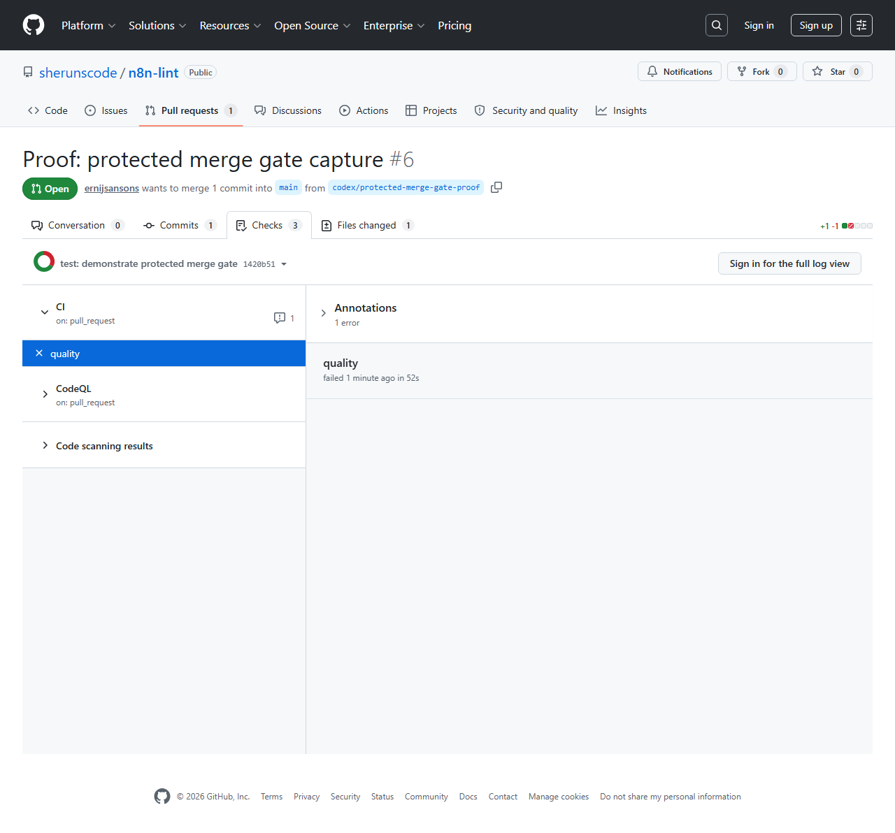

# GitHub PR Merge-Gate Proof

This is a real GitHub PR checks tab screenshot, not a mockup.

Asset path: `docs/assets/github-pr-merge-gate-proof.png`

## Evidence

- Proof-only PR: `https://github.com/sherunscode/n8n-lint/pull/6`
- Purpose: capture a real protected GitHub merge-gate failure screenshot for
  the n8n-lint launch checklist.
- PR title: `Proof: protected merge gate capture`
- PR state after capture: closed.
- PR merge state at proof check: `BLOCKED` from the failed required status
  check.
- Branch protection: `main` requires the `quality` status check for non-admins.
- Proof commit: `1420b51`.
- Remote proof branch deleted after capture: `codex/protected-merge-gate-proof`.
- The proof-only PR intentionally rewired the quality script to fail and must
  not be merged.
- Failing CI run:
  `https://github.com/sherunscode/n8n-lint/actions/runs/28958780193`
- Failing quality job:
  `https://github.com/sherunscode/n8n-lint/actions/runs/28958780193/job/85924615158`
- Failing job name: `quality`
- Failing job conclusion: `FAILURE`
- Successful CodeQL run:
  `https://github.com/sherunscode/n8n-lint/actions/runs/28958780281`
- CodeQL conclusion: `SUCCESS`

## Boundaries

- This proof does not claim the failing branch was product work.
- This proof confirms the PR was blocked by the failed required status check.
- This proof does not keep the failing branch alive.
- The durable artifact is the screenshot plus public GitHub run metadata checked
  by `npm run check:github-pr-gate-proof`.
